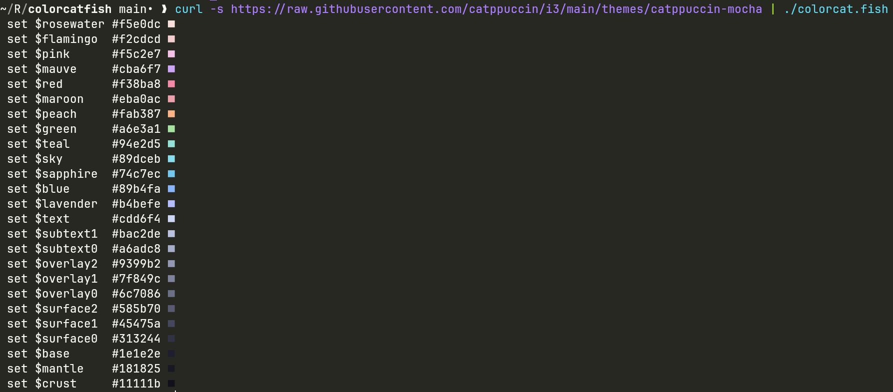

# ColorCat.fish

**ColorCat.fish** is a *native fish* script that displays a color scheme for any file containing hex color codes.

## Installation

You can install ColorCat.fish by following these simple steps:

1. Clone the repository or download the `colorcat.fish` script to your local machine.
2. Make the script executable with the following command:

    ```sh
    chmod +x colorcat.fish
    ```

## Usage

To use ColorCat.fish, you can pipe the output of a file with hex color codes into the script. Here's an example
```sh
curl -s https://raw.githubusercontent.com/catppuccin/i3/main/themes/catppuccin-mocha | ./colorcat.fish
```

This will display the color scheme with colored boxes next to each hex color code.



### Inspiration >> [bash verison](https://gist.github.com/sebastiancarlos/f712954caa8914032f6ebc867e9f8e4f)
